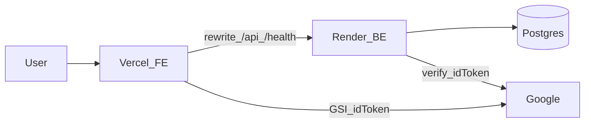
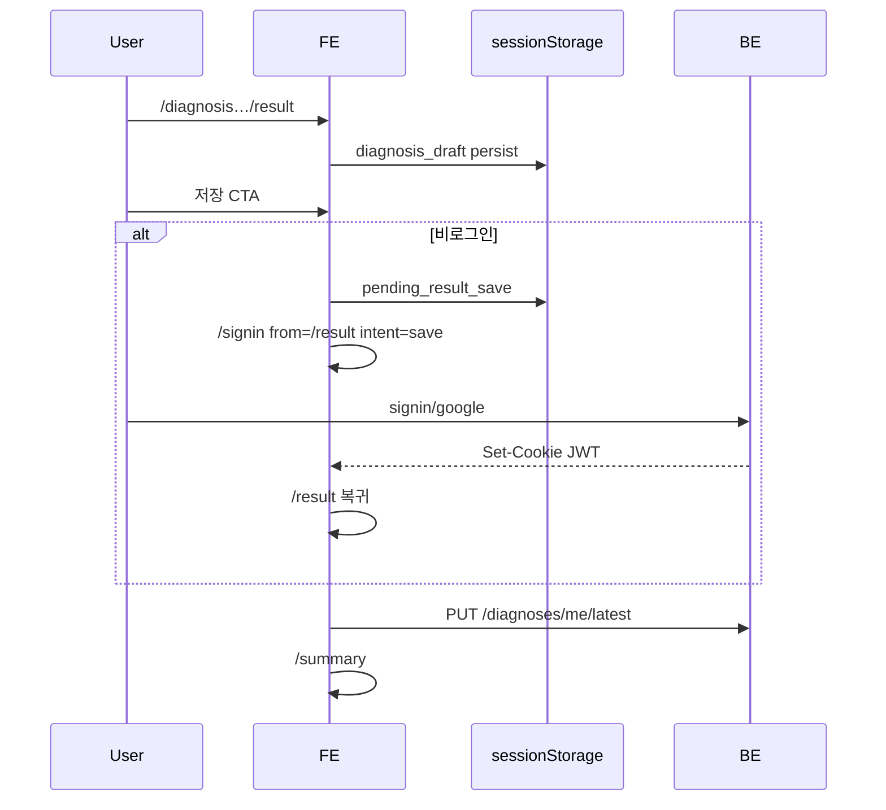

# 고도화 기능 설계 · 흐름 정의서

> 갱신: 2026-08-04 · **현 미션(보안·품질 고도화) 마감 핸드오프**  
> 대상: `retirement-frontend` + `retirement-backend` (제품: 은퇴현금 설계센터)  
> 정본: 이 문서 · BE 요약: `retirement-backend/docs/feature-design-flow.md`  
> 보안 감사 상세 표는 레포 외부(Drive 등) 보관 · Deferred 요약만 §7  
> 다음 미션: **지표(metrics) · 로그(logging) 설계** — §8 계측 포인트를 이어서 사용

---

## 1. 목적

현 코드 기준으로 **구현된 기능·흐름·경계**를 고정해, 다음 미션(지표·로그)과 이후 기능 고도화 시 재탐색 비용을 줄인다.  
추측 없이 **라이브 경로**(`BE: index → bootstrap`, `FE: router + /api rewrite`)만 기술한다.

---

## 2. 시스템 경계

| 계층 | 스택 · 배포 | 역할 |
|------|-------------|------|
| FE | React 19 · Vite · RTK · Vercel | 진단 UI, 세션 부트, `/api`·`/health` rewrite → Render |
| BE | Express · Prisma · PostgreSQL · Render | Auth · Diagnosis · Simulation · Portfolio |
| 세션 | HttpOnly 쿠키 `retirement_token` (`Path=/api`, SameSite=Lax) | 토큰 body/localStorage 미사용 |



---

## 3. 도메인 맵 (구현 완료)

| 도메인 | BE 경로 | FE 주요 화면 | 비고 |
|--------|---------|--------------|------|
| Auth | `/api/auth/*` | `/signin`, `/signup` | signup=`REGISTRATION_UNAVAILABLE` 단일화 |
| User | `/api/users/me` | `/account` | 탈퇴 hard delete + cascade |
| Diagnosis | `/api/diagnoses/me/latest` | 진단 플로우 → `/result` → `/summary` | 유저 1건 · 연금 금액 서버 0 sanitize |
| Simulation | `/api/simulations/*` | `/simulation/*`, dashboard | 7타입 · 소유권 검사 |
| Portfolio | `/api/pension-portfolios` | `/portfolio` | CRUD + IDOR 방지 |
| Health | `GET /health` | `warmBackend` | 콜드스타트 완화 |

별도 retirement-goals API **없음** — 진단(Diagnosis)이 목표·현금흐름 입력 역할을 수행.

---

## 4. 핵심 사용자 흐름

### 4.1 게스트 진단 → 저장 → 요약 (메인)



- 결과 **열람**은 비로그인 가능 · **영속 저장**만 인증.
- 로그인 후 draft hydrate로 리로드·리다이렉트 복구 (`diagnosis-draft` / `pension-draft`).

### 4.2 Google 계정 연동

1. `POST /auth/google` (ID 토큰)  
2. 이메일 계정 미연결 → `ACCOUNT_LINK_REQUIRED`  
3. FE 비밀번호 패널 → `POST /auth/google/link`  
4. 성공 시 쿠키 발급 · 패널 종료  

(가입 실패는 방식 비공개 `REGISTRATION_UNAVAILABLE` — 연동 게이트와 분리)

### 4.3 주택연금

- 경로 `/simulation/housing-pension` — **게스트 로컬 계산 가능**  
- 로그인 시 API 생성·latest 조회 · 「현금흐름 반영」→ 진단 pension.housing

### 4.4 탈퇴

- `DELETE /users/me` — 비밀번호 또는 Google-only(이메일+`"탈퇴합니다"`)  
- 재인증 실패=`INVALID_CREDENTIALS`(세션 유지) · 성공 시 draft clear + logout → `/`

---

## 5. FE 상태 · 라우팅 원칙

| 저장소 | 내용 |
|--------|------|
| Redux | `auth`, `toast`만 |
| Diagnosis Context | 진단 런타임 · projection |
| sessionStorage | draft · pending save · logout/401 시 `clearClientRetirementSession` |

- Protected: `/summary`, `/account`, `/cashflow-plan`, 대부분 `/simulation/*`, `/portfolio`  
- 공개 예외: `/result`, `/simulation/housing-pension`  
- `returnTo`: 상대경로만 (`resolveSafeReturnTo`)  
- `checkAuth`: 401≠네트워크 오류 (`error` + 재시도)

---

## 6. BE 설계 원칙 (유지)

- Clean Architecture: Controllers → Services → Repos · DI=`bootstrap.ts`  
- Zod write 경로 · `BusinessException`/`TechnicalException`  
- Production: CORS=`FRONTEND_ORIGIN` fail-closed · Bearer 무시 · json 64kb  
- Rate: auth 20 / api 300 / health 120 (15분)  
- 세션: idle 30분 슬라이딩 · absolute 12시간 (`sessionStartedAt`)  
- 소유권: Simulation · Portfolio · Diagnosis `/me` 스코프

---

## 7. 현 미션 마감 상태

| 구분 | 상태 |
|------|------|
| Critical / High 보안 | Fixed (IDOR·CORS·redirect·열거·레거시 등) |
| CSP style unsafe-inline | Accepted (Low, 미착수) |
| JWT denylist · 비밀번호 복잡도 | Deferred → 제품·인프라 합의 후 |
| 프로덕션 핵심 플로우 | 운영 확인 완료 |

---

## 8. 다음 미션 핸드오프 — 지표 · 로그 계측 포인트

다음 미션에서 **이벤트·로그 스키마를 붙일 후보** (현 코드에 이미 존재하는 경계).

### 8.1 제품 지표 (권장 funnel)

| ID | 이벤트 | 트리거 위치 (개념) |
|----|--------|-------------------|
| `diag_start` | 진단 시작 | Welcome → `/diagnosis` |
| `diag_step` | 단계 완료 | profile/cashflow/scenario/medical |
| `diag_result_view` | 결과 열람 | `/result` mount |
| `diag_save_intent` | 저장 클릭 | ProjectionScreen |
| `auth_gate` | 저장 위해 로그인 유도 | pending_result_save set |
| `auth_success` | 로그인/가입/Google 성공 | useAuth |
| `auth_link_required` | Google 연동 게이트 | ACCOUNT_LINK_REQUIRED |
| `diag_save_ok` | PUT diagnosis 성공 | diagnosis-api |
| `summary_view` | 요약 진입 | `/summary` |
| `sim_run` | 시뮬 실행 | type별 create |
| `housing_guest_calc` | 게스트 주택연금 | 로컬 calculate |
| `account_delete` | 탈퇴 성공 | AccountScreen |

### 8.2 기술 로그 (권장)

| 영역 | 무엇을 | 비고 |
|------|--------|------|
| BE request | method·path·status·latency·`requestId` | PII 제외 · userId는 해시/내부 id |
| Auth | signup/signin/google 결과 코드 | `REGISTRATION_UNAVAILABLE` 카운트≠열거 노출 |
| 소유권 거부 | 403 `*_FORBIDDEN` | 보안 모니터링 |
| FE | ApiError code · warm/health 실패 | Render 콜드스타트 상관 |
| 세션 | idle/absolute 만료 구분 | denylist 도입 시 연계 |

### 8.3 설계 시 제약 (현 보안 원칙과 충돌 금지)

- 로그/지표에 **이메일·비밀번호·원문 JWT·정확한 연금 실액** 금지 (진단은 서버 0 sanitize와 정합)  
- 가입 실패 지표는 **단일 코드**만 집계 (방식 구분 메트릭 금지)  
- 게스트와 로그인 경로를 구분할 수 있게 `anonymous_id`(쿠키/세션) vs `userId` 설계  

---

## 9. 주요 경로 인덱스

```
FE: src/router.tsx · screens/* · hooks/useAuth.ts · hooks/useDiagnosis.tsx
    api/* · utils/{safe-return-to,diagnosis-draft,warm-backend}.ts
BE: src/index.ts · bootstrap.ts · inbound/controllers/*
    application/services/* · shared/session-policy.ts · prisma/schema.prisma
```

---

## 10. 마감 체크

- [x] 보안 라운드 문서화·프로덕션 검증  
- [x] 본 설계·흐름 정의서 작성 (다음 미션 입력)  
- [x] 다음: 지표 카탈로그·로그 스키마·수집 파이프라인 확정 → `docs/mission9-1/`  
